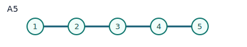

# Ostrik ADE Modules

This page explains the graph picture behind Ostrik's classification for
`SU(2)_k` module categories, and how the package names/functions map to it.

## 0) Load packages

Main package:

```gap
LoadPackage("FusionRings");;
```

Optional graph toolkit inside GAP:

```gap
LoadPackage("grape");;
```

`grape` is not required for FusionRings itself. It is only for extra graph
operations/visual checks.

## 1) Notation bridge: paper vs GAP

- In Ostrik's paper, the category is written as `C_l` (level `l`).
- In this package we use the usual `SU(2)_k` notation (level `k`).
- For this family, you can read `l = k`.

In GAP, the ring side is created by:

```gap
md := VerlindeModularData("A", 1, k);;
F := FusionRingFromModularData(md);;
```

## 2) What is "the graph" here?

For a based module `M` over the fusion ring `F`, the fundamental simple object
(`X_1`) acts by a nonnegative integer matrix `A`. This is the nimrep adjacency
matrix, so it defines a graph.

For `SU(2)_k`, all action matrices are reconstructed by:

`N_1 = I`, `N_2 = A`, `N_{j+1} = A*N_j - N_{j-1}`.

That is exactly why one graph can reconstruct the whole module action in this
family.

## 3) ADE statement (informal)

At fixed level `k`, irreducible module categories over `SU(2)_k` correspond to
ADE diagrams with Coxeter number `h = k + 2`:

- `A_{k+1}` always,
- `D_{k/2+2}` for even `k`,
- exceptional: `E6` at `k=10`, `E7` at `k=16`, `E8` at `k=28`.

## 4) APIs in this package

- `DynkinGraphAdjacency(type[, n])`
- `OstrikSU2Module(k, type[, n][, opts])`
- `OstrikSU2Modules(k)`
- `IsOstrikSU2Module(M, k[, type[, n]])`
- `FusionModuleGraph(M[, i])` (graph data: vertices/edges/adjacency)

## 5) Quick examples

```gap
mods4 := OstrikSU2Modules(4);;
List(mods4, x -> x.type);
# [ "A", "D" ]

mods10 := OstrikSU2Modules(10);;
List(mods10, x -> x.type);
# [ "A", "D", "E6" ]
```

Validation check:

```gap
M := OstrikSU2Module(10, "E6");;
IsOstrikSU2Module(M, 10, "E6");
# true
```

## 6) Built-in graph data and visualization paths

### A) In-package (text/records)

```gap
M := OstrikSU2Module(4, "D");;
g := FusionModuleGraph(M, LabelOfPosition(UnderlyingFusionRing(M), 2));;
g.mode;
g.edges;
```

This gives edges as triples `[source, target, weight]`.

### B) Visualize inside GAP via GRAPE

If GRAPE is installed (it is available in this environment), you can build a
graph object from adjacency:

```gap
LoadPackage("grape");;
adj := DynkinGraphAdjacency("E6");;
G := Graph(Group(()), [1..Length(adj)], OnPoints,
  function(x, y) return adj[y][x] <> 0; end, true);;
OrderGraph(G);;
IsConnectedGraph(G);;
```

### C) Export to DOT (Graphviz)

You can print DOT from `FusionModuleGraph` and render with Graphviz:

```gap
M := OstrikSU2Module(4, "D");;
g := FusionModuleGraph(M, LabelOfPosition(UnderlyingFusionRing(M), 2));;
Print("digraph Nimrep {\n");
for e in g.edges do
  Print("  \"", e[1], "\" -> \"", e[2], "\" [label=\"", e[3], "\"];\n");
od;
Print("}\n");
```

Then save as `nimrep.dot` and run:

```bash
dot -Tpng nimrep.dot -o nimrep.png
```

Package helper for SVG output:

```gap
SaveFusionModuleGraphSVG("nimrep.svg", M, LabelOfPosition(UnderlyingFusionRing(M), 2));
```

## 7) Reference shapes (static)

Typical examples:




